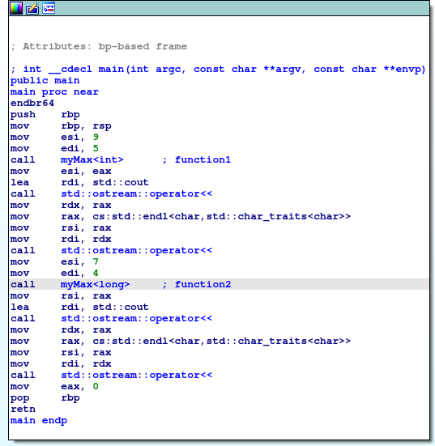
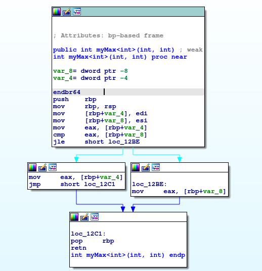
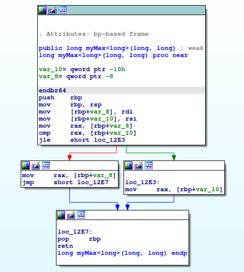

# Basic template in c++ for reversing

This a quick Guide on understanding reversing Basic templates in c++. The notes are from the templates section of the opensecurity training course.

# what are Templates

A template is a c++ entity that defines one of the following:

- A family of classes(class template) which may be nested classes
- A family of functions(function template) which may be nested functions
- An alias to a family of types( alias template) >c++11
- A family of variables(variable template) > c+=14

The **goal of templates** is to pass data type as a parameter so that we don't need to write the same code for different types.

Example of template code to find maximum number of two parameters passed to template.

```cpp
include <iostream>

template <typename T>
T myMax(T x, T y ){
    return (x > y)? x: y;
}

int main(){
    std::cout << myMax<int>(5, 9)<<std::endl;  //int data type
    std::cout <<myMax<long>(4, 7)<<std::endl;  //long data type

}
```

Compile the above code using g++ compiler as shown below.

```bash
g++ template.cpp -o template
```

After a successful compilation process you will have a binary called template. load the binary into the **ida** for further analysis.

## Step by step guide on Reversing Templates

These are steps followed by watching the video provided by the author.

### Step 1: First Identify all the function calls in the binary

The first goal is to identify all the function calls in the given binary



From the above image, we have six function calls , in which four are standard library function calls.  The user function are **myMax<int>** and **myMax<long>** .

## Step 2. identify all the parameters  being passed to the function


## step 3. Examine the parameters passed to the function and their types

when reversing templates, it is better to understand the data types passed to the functions you are reversing. For stripped binaries, data types will be lost, will not be easily recognizable as shown in the image below.


From the above image, we are passing two parameters to our functions. In **x64** calling convention, the first parameter is passed to **rdi** register and second to **rsi**.

The **myMax<int>**  " function" takes two int values in which are 5 and 9 respectively.

The **myMax<long>** " function" take two long values in  which are 4 and 7 respectively.

## step 4. Next is to understand the purpose of each function



The first function takes  two values ( 5 and 9) and compares the values as shown in the code above. then it returns the greatest value.



The second function takes  two values (4 and 7) and compares the values as shown in the code above. then it returns the greatest value.

## Conclusion

Therefore if the two functions perform the same functionality, but different data types, then it is a template. From our case example. we have a template that looks for a maximum values of the two arguments passed to the template.

The data types used by the template are int and long.

NB : For defining templates in IDA, right click the function to edit  and click  edit function or press ALT+p .  

Tip: use mangled names when defining templates.
